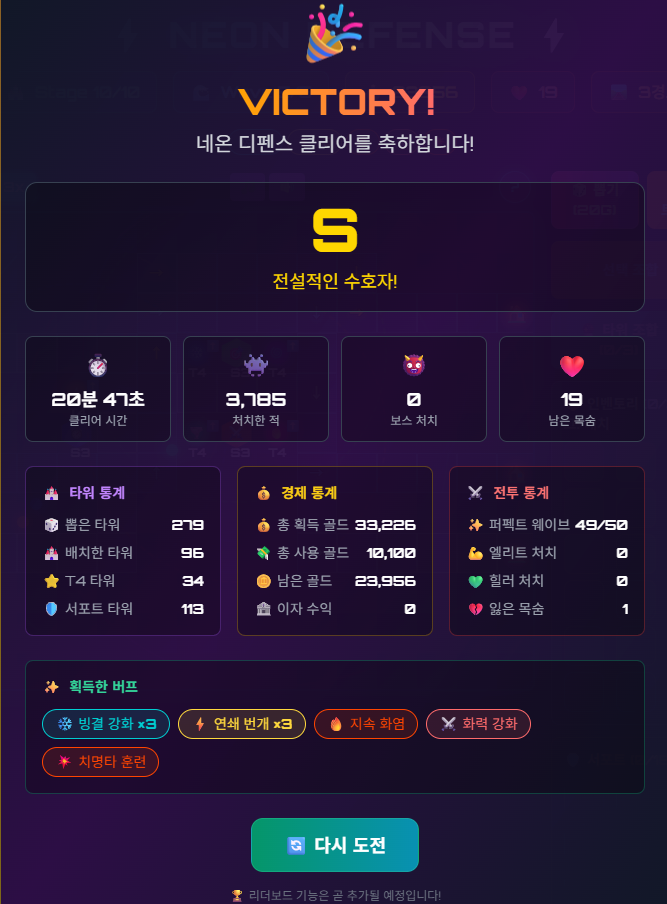

##Log

balance-logger.js:248 🎮 밸런스 로그 - ❌ 게임오버
balance-logger.js:249 📅 2026. 2. 5. 오후 11:39:30
balance-logger.js:250 ⏱️ 21분 7초
balance-logger.js:251 🏰 Stage 10-5
balance-logger.js:252 💰 남은 골드: 24577G | 목숨: 0
balance-logger.js:253 🏰 타워: 5개 (T4: 5)
balance-logger.js:254 🛡️ 서포트: 0개
balance-logger.js:255 👾 총 킬: 3713
balance-logger.js:258 ⚠️ 밸런스 경고
balance-logger.js:259 [gold] 남은 골드 과다 (24577G) - 경제 너무 여유로움
balance-logger.js:259 [lives] 목숨 부족 (0) - 난이도 너무 어려움
balance-logger.js:259 [difficulty] 퍼펙트 비율 98% - 난이도 하향 필요

🎮 밸런스 로그 - ✅ 클리어
balance-logger.js:249 📅 2026. 2. 6. 오전 12:07:52
balance-logger.js:250 ⏱️ 20분 45초
balance-logger.js:251 🏰 Stage 10-5
balance-logger.js:252 💰 남은 골드: 23956G | 목숨: 19
balance-logger.js:253 🏰 타워: 5개 (T4: 5)
balance-logger.js:254 🛡️ 서포트: 3개
balance-logger.js:255 👾 총 킬: 3785
balance-logger.js:258 ⚠️ 밸런스 경고
balance-logger.js:259 [gold] 남은 골드 과다 (23956G) - 경제 너무 여유로움
(anonymous) @ balance-logger.js:259Understand this warning
balance-logger.js:259 [lives] 남은 목숨 과다 (19) - 난이도 너무 쉬움
(anonymous) @ balance-logger.js:259Understand this warning
balance-logger.js:259 [difficulty] 퍼펙트 비율 98% - 난이도 하향 필요

[SaveLoad] 게임 불러오기 완료: 10 5
save-system.js:139 [SaveSystem] 자동 저장 시작 (30초 간격)
App.jsx:130 [App] 저장 데이터 적용 중...
react-dom.production.min.js:121 TypeError: gameState.setPermanentBuffs is not a function
    at <anonymous>:202:15
    at Id (react-dom.production.min.js:165:137)
    at Xb (react-dom.production.min.js:200:284)
    at Sk (react-dom.production.min.js:198:114)
    at yb (react-dom.production.min.js:196:166)
    at Mi (react-dom.production.min.js:189:373)
    at db (react-dom.production.min.js:79:182)
    at react-dom.production.min.js:184:289
wf @ react-dom.production.min.js:121
c.callback @ react-dom.production.min.js:121
Fh @ react-dom.production.min.js:92
Ki @ react-dom.production.min.js:180
Ii @ react-dom.production.min.js:179
Ik @ react-dom.production.min.js:178
Sk @ react-dom.production.min.js:197
yb @ react-dom.production.min.js:196
Mi @ react-dom.production.min.js:189
db @ react-dom.production.min.js:79
(anonymous) @ react-dom.production.min.js:184Understand this error
react-dom.production.min.js:79 Uncaught TypeError: gameState.setPermanentBuffs is not a function

